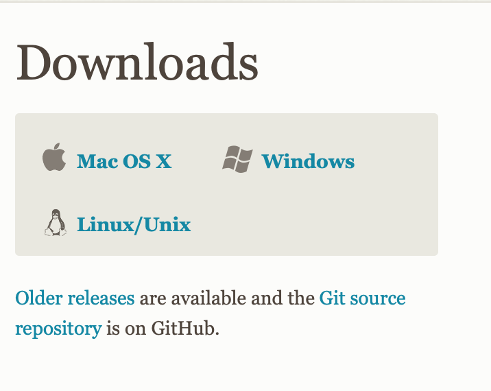

<br> </br>
<div class="col-sm-10">

```{r setup, include=FALSE}
knitr::opts_chunk$set(echo = TRUE)
```

<!--- Tirulo --->
<h1 style="color:black;">Tres caminos para clonar/descargar un repositorio de GitHub </h1>

<p align="justify" style="font-size:18px;"> Para replicar las clases del curso "Taller de R: Estadística y programación" (ver repositorio del curso en GitHub [aquí](https://github.com/taller-R)) o cualquier otro repositorio libre en GitHub, usted puede seguir cualquiera de estos tres caminos. Sin embargo, en cualquiera de los tres casos, es necesario que usted se registre y cree una cuenta en [GitHub](https://github.com/) previamente. </p>

<!--- 1. Subtirulo --->
<h2 style="color:red;"> 1. Descargar el respositorio manualmente. </h2>

<p align="justify" style="font-size:18px;"> La forma más sencilla de descargar un repositorio de GitHub para replicar la clase es descargar manualmente la carperta completa del repositorio. Para ello, usted debe ir al repositorio y hacer clic en </img> y después hacer clic en </img>. </p> 


<p align="justify" style="font-size:18px;"> Al hacer esto usted obtiene un archivo de extención **.zip** que debe descomprimir. Desde este momento usted puede usar todos los archivos del repositorio. Para propositos de la clase, es importante que usted lea los archivos *README.html* y el otro archivo *.html* que está en la carpeta **help**.</p> 

<!--- 2. Subtirulo --->
<h2 style="color:red;"> 2. Usando la URL del repositorio. </h2>

<p align="justify" style="font-size:18px;"> Podemos descargar el repositorio usando la *URL* del archivo **.zip**. Para ello, primero vamos a ir a la consola de Rstudio y generamos un script y pegamos directorio de trabajo en el que deseamos descargar la carpeta. </p>

</img>

<p align="justify" style="font-size:18px;"> Y copiamos el código que se genera en la consola ```setwd("~/Downloads")``` y lo pegamos en el script. </p>

```{r}
# By: Eduard Martinez
# Date: 16-08-2020

# Vamos a establecer el directorio de trabajo
#setwd("~/Downloads")
```

<p align="justify" style="font-size:18px;"> Ahora vamos al repositorio en GitHub y hacemos clic en </img> y después hacemos clic derecho sobre </img> para que se despliegue el siguiente menu:</p>  

</img>

<p align="justify" style="font-size:18px;"> Ahora, debe hacer clic sobre </img>. Esto copiará la *URL* que contiene el archivo **.zip** del repositorio. Ahora vamos a usar la función ```download.file``` del paquete ```utils``` (este paquete viene por default en la instalación de R, así que no deberia tener problemas). Hacemos paste de la *URL* en el argumento ```url``` y en el argumento ```destfile``` escribimos el nombre que le queremos asignar a nuestra carpeta. </p>  

```{r}
# Descargar el repositorio
#download.file(url = "https://github.com/taller-R/Clase_1/archive/master.zip", 
#              destfile = "clase_1.zip")
```

<p align="justify" style="font-size:18px;"> Ahora debemos tener en un nuestro directorio de trabajo, un archivo llamdo "clase_1.zip" en formato **.zip** son el contenido del repositorio. </p>  

</img>

<p align="justify" style="font-size:18px;"> Ahora vamos a descomprimir este archivo, para ello vamos a usar la función  ```unzip``` del paquete ```utils```. </p>  

```{r}
# Descomprimir el archivo
#unzip(zipfile = "clase_1.zip")
```

<p align="justify" style="font-size:18px;"> Ahora debemos tener en un nuestro directorio de trabajo, una carpeta llamda "clase_1-master" con el contenido del repositorio. </p>  

</img>

<p align="justify" style="font-size:18px;"> Fijamos nuestro nuevo directorio de trabajo hasta la carpeta que descomprimimos ```setwd("~/Downloads/clase_1-master")``` e inspeccionamos los archivos que contiene ```list.files()``` </p>  

```{r}
# Cambiar el directorio de trabajo
#setwd("~/Downloads/clase_1-master")

# Inspeccionar archivos en el directorio 
list.files()
```

<p align="justify" style="font-size:18px;"> Listo ya puedes ir a la carpeta **codes** y a la carpeta **help** para que abras el archivo **Clase 1.R** y el archivo **Clase 1.html**. A replicar la clase!. </p>  

<!--- 3. Subtirulo --->
<h2 style="color:red;"> 3. Crear un proyecto de versión de control. </h2>

<p align="justify" style="font-size:18px;"> Otra forma de replicar un repositorio en GitHub, es crear un proyecto de versión de control en R. Para ello, primero tenemos que istalar [git](https://git-scm.com), un sistema de control de versiones. Primero tenemos que elegir el instalador que sea compatible con el sistema operativo de nuestro computador. </p>

</img>

<!--- 3. Subtirulo --->
<h3 style="color:red;"> 3.1.1 Instalación de Git en Windows. </h3>

<p align="justify" style="font-size:18px;"> Si usted tiene un Windows solo debe descargar el instalador de [git bash](https://git-scm.com/download/win) (Git for Windows Setup de 32-bit o 64-bit) e instalarlo. </p>

</img>

<!--- 3. Subtirulo --->
<h3 style="color:red;"> 3.1.2 Instalación de Git en Mac. </h3>

<p align="justify" style="font-size:18px;"> Si usted tiene un Mac, primero debe ir a la terminal de su equipo (puede hacerlo desde Rstudio) e instalar [Homebrew](https://brew.sh/index_es). "*Homebrew* instala todo aquello que necesitas que Apple no instala de serie". Para instalarlo, debes copiar este codígo ```/bin/bash -c "$(curl -fsSL https://raw.githubusercontent.com/Homebrew/install/master/install.sh)"``` y pegarlo en la terminal.</p>

</img>

<p align="justify" style="font-size:18px;"> Ahora puede instalar Git copiando y pengando este comnado en la terminal ```brew install git```.</p>

</img>

<!--- 3. Subtirulo --->
<h3 style="color:red;"> 3.2 Configuración inicial de Git. </h3>

<p align="justify" style="font-size:18px;"> Ahora vamos a configurar nuestra cuenta de GitHub desde la terminal. Este proceso solo se realiza una vez. Primero vamos a la consol e inscribimos la ssiguiente linea de código: .</p>


</div>