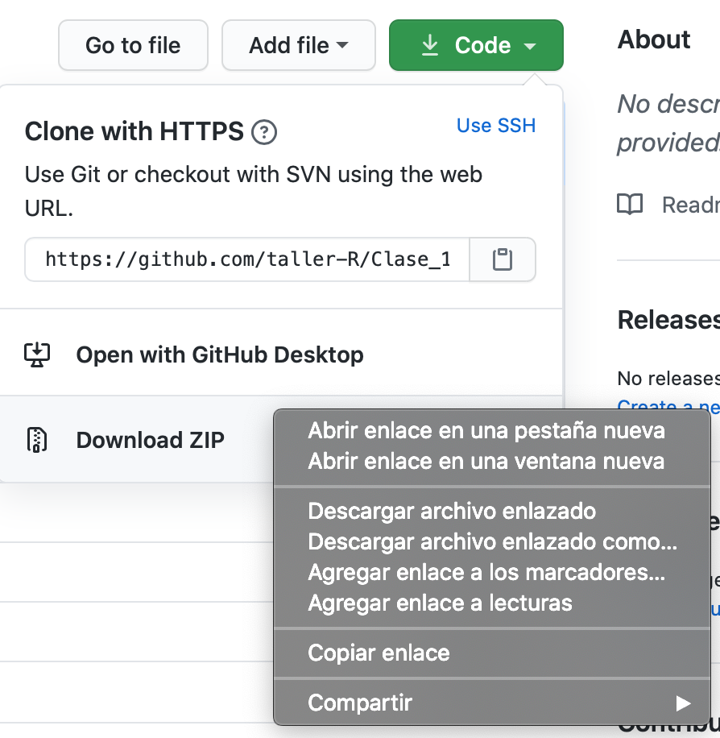
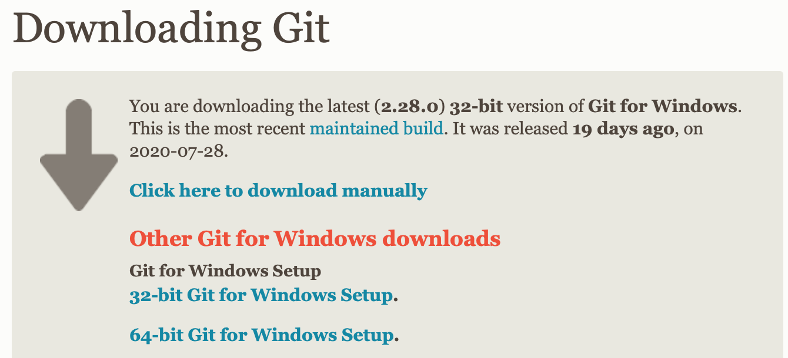
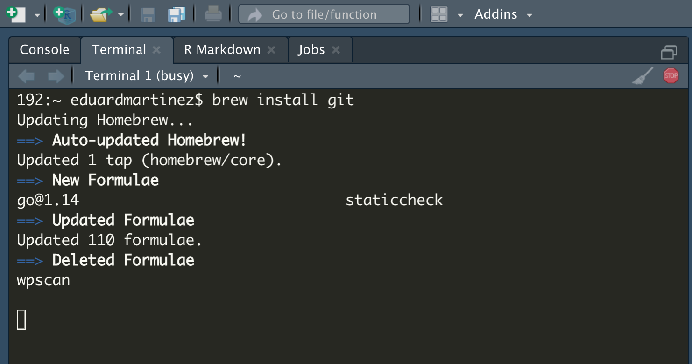
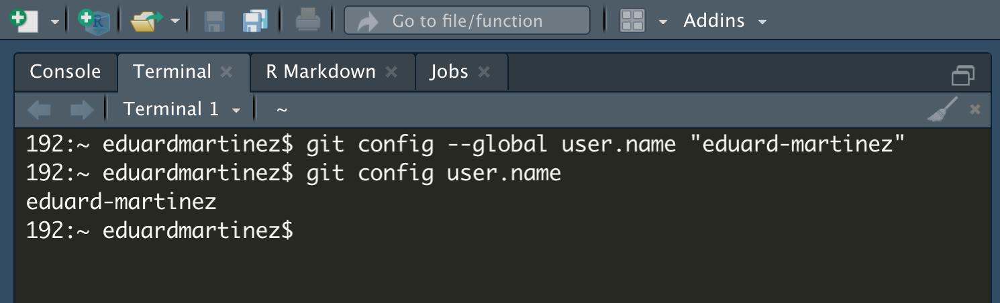
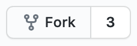
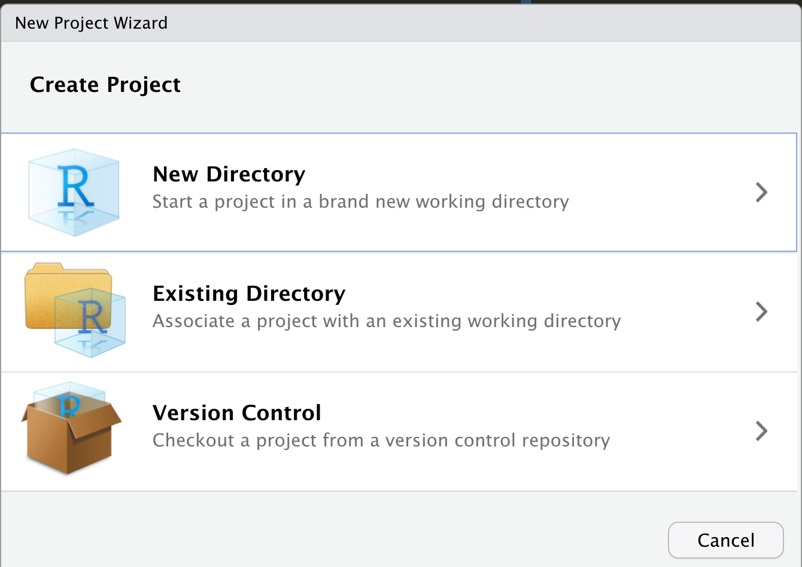
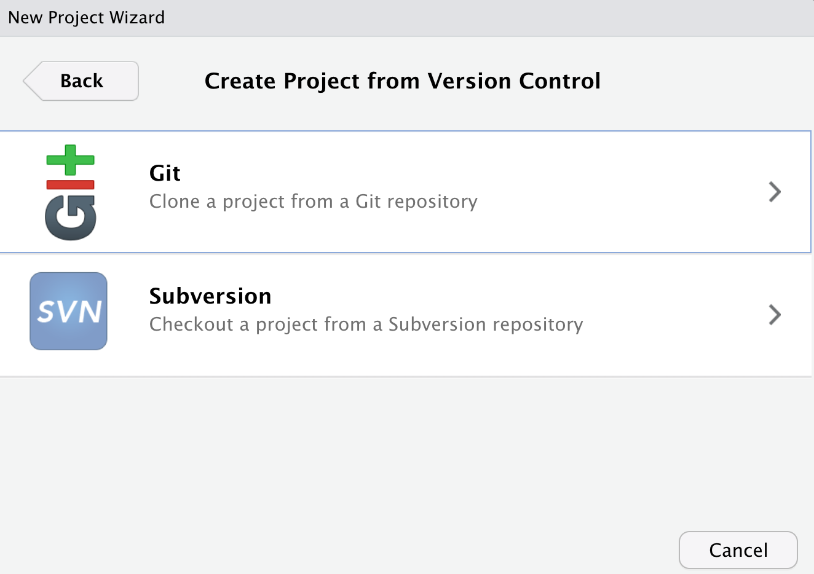
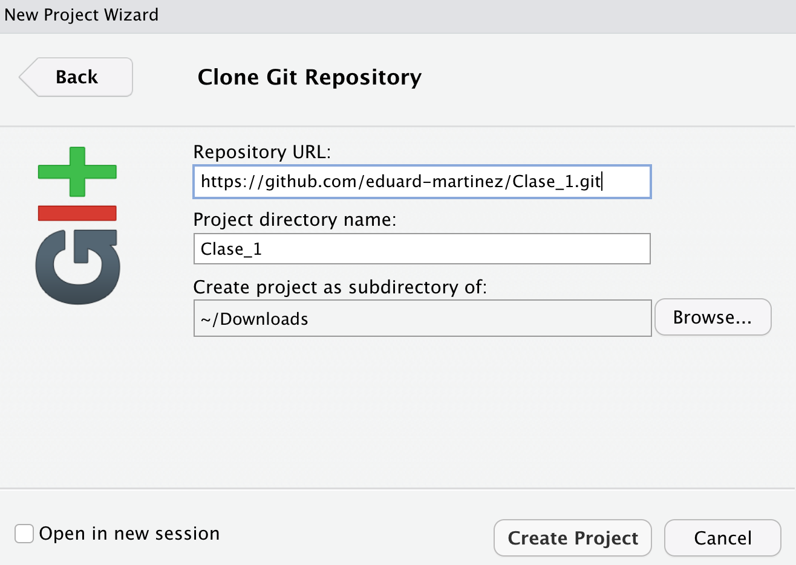

<!--- Inicio Emcabezado --->
<html>
<head>
<meta charset="utf-8" />
<meta name="generator" content="pandoc" />
<meta http-equiv="X-UA-Compatible" content="IE=EDGE" />
<title>Eduard F. Martínez-González</title>
<script src="site_libs/jquery-1.11.3/jquery.min.js"></script>
<meta name="viewport" content="width=device-width, initial-scale=1" />
<link href="site_libs/bootstrap-3.3.5/css/cerulean.min.css" rel="stylesheet" />
<script src="site_libs/bootstrap-3.3.5/js/bootstrap.min.js"></script>
<script src="site_libs/bootstrap-3.3.5/shim/html5shiv.min.js"></script>
<script src="site_libs/bootstrap-3.3.5/shim/respond.min.js"></script>
<script src="site_libs/navigation-1.1/tabsets.js"></script>
<script src="site_libs/accessible-code-block-0.0.1/empty-anchor.js"></script>
<link href="site_libs/font-awesome-5.1.0/css/all.css" rel="stylesheet" />
<link href="site_libs/font-awesome-5.1.0/css/v4-shims.css" rel="stylesheet" />
</head>
<body>
<div class="container-fluid main-container">
<div class="navbar navbar-inverse  navbar-fixed-top" role="navigation">
<div class="container">
<div class="navbar-header">
<button type="button" class="navbar-toggle collapsed" data-toggle="collapse" data-target="#navbar">
<span class="icon-bar"></span>
<span class="icon-bar"></span>
<span class="icon-bar"></span>
</button>

<a class="navbar-brand" href="https://eduard-martinez.github.io/index.html">Eduard F. Martínez-González</a>
</div> <div id="navbar" class="navbar-collapse collapse">
<ul class="nav navbar-nav"> </ul> <ul class="nav navbar-nav navbar-right">

<li><a href="https://eduard-martinez.github.io/index.html"><span class="fa fa-home"></span>Home</a></li>

<li><a href="https://eduard-martinez.github.io/research.html">Research</a></li>

<li><a href="https://eduard-martinez.github.io/cv/C_Eduard_F_Martinez_G.pdf">CV</a></li>

<li><a href="https://eduard-martinez.github.io/teaching.html">Teaching</a></li>

<li><a href="https://eduard-martinez.github.io/blog.html">Blog</a></li>

<li><a href="https://eduard-martinez.github.io/databases.html">Databases</a></li>

</div><!--/.nav-collapse -->
</div><!--/.container -->
</div><!--/.navbar -->
<div class="fluid-row" id="header">
<!--- Fin Emcabezado --->


<!--------------------------------- El codigo inicia aca --------------------------------->

<br> </br>

<!------------- Panel de la izquierda ------------->
<div class="col-sm-9">

```{r setup, include=FALSE}
knitr::opts_chunk$set(echo = TRUE)
```

<!--- Tirulo --->
<h1 style="color:black;">Tres caminos para clonar/descargar un repositorio de GitHub </h1>

<p align="justify" style="font-size:18px;"> Para replicar las clases del curso "Taller de R: Estadística y programación" (ver repositorio del curso en GitHub [aquí](https://github.com/taller-R)) o cualquier otro repositorio libre en GitHub, usted puede seguir cualquiera de estos tres caminos. Sin embargo, en cualquiera de los tres casos, es necesario que usted se registre y cree una cuenta en [GitHub](https://github.com/) previamente. </p>

<!--- 1. Subtirulo --->
<h2 style="color:red;"> 1. Descargar el respositorio manualmente. </h2>

<p align="justify" style="font-size:18px;"> La forma más sencilla de descargar un repositorio de GitHub para replicar la clase es descargar manualmente la carperta completa del repositorio. Para ello, usted debe ir al repositorio y hacer clic en </img> y después hacer clic en </img>. </p> 


<p align="justify" style="font-size:18px;"> Esto generará en su carpeta de descargas un archivo de extención **.zip** que debe descomprimir. Al descomprimir el archivo, usted obtiene una carpeta con todos los archivos del repositorio. Para propositos de la clase, es importante que usted lea los archivos *README.html* y el otro archivo *.html* que está en la carpeta **help**.</p> 

<!--- 2. Subtirulo --->
<h2 style="color:red;"> 2. Usando la URL del repositorio. </h2>

<p align="justify" style="font-size:18px;"> Podemos descargar el repositorio usando la *URL* del archivo **.zip**. Para ello, primero vamos a ir a la consola de Rstudio y generamos un script. Después seleccionamos el directorio de trabajo en el que deseamos descargar la carpeta. </p>

</img>

<p align="justify" style="font-size:18px;"> Copiamos el código que se genera en la consola ```setwd("~/Downloads")``` y lo pegamos en el script. </p>

```{r,eval=F}
# By: Eduard Martinez
# Date: 16-08-2020

# Vamos a establecer el directorio de trabajo
setwd("~/Downloads")
```

<p align="justify" style="font-size:18px;"> Ahora vamos al repositorio en GitHub y hacemos clic en </img> y después hacemos clic derecho sobre </img> para que se despliegue el siguiente menu:</p>  

</img>

<p align="justify" style="font-size:18px;"> Ahora, debe hacer clic sobre </img>. Esto copiará la *URL* que contiene el archivo **.zip** del repositorio. Ahora vamos a descargar el repositorio usando la función ```download.file``` del paquete ```utils``` (este paquete viene por default en la instalación de R, así que no deberia tener problemas). Pegamos la *URL* que copiamos en el argumento ```url``` y en el argumento ```destfile``` escribimos el nombre que le queremos asignar a nuestra carpeta. </p>  

```{r,eval=F}
# Descargar el repositorio
download.file(url = "https://github.com/taller-R/Clase_1/archive/master.zip", 
              destfile = "clase_1.zip")
```

<p align="justify" style="font-size:18px;"> Después de correr estas lineas, se genera en nuestro directorio de trabajo un archivo llamdo "clase_1.zip" en formato **.zip** con el contenido del repositorio. </p>  

</img>

<p align="justify" style="font-size:18px;"> Ahora vamos a descomprimir este archivo usando la función  ```unzip``` del paquete ```utils```. </p>  

```{r,eval=F}
# Descomprimir el archivo
unzip(zipfile = "clase_1.zip")
```

<p align="justify" style="font-size:18px;"> Debemos tener en un nuestro directorio de trabajo una carpeta llamda "clase_1-master" con el contenido del repositorio. </p>  

</img>

<p align="justify" style="font-size:18px;"> Ya podemos fijar nuestro nuevo directorio de trabajo hasta la carpeta que descomprimimos ```setwd("~/Downloads/clase_1-master")``` e inspeccionamos los archivos que contiene ```list.files()``` </p>  

```{r,eval=F}
# Cambiar el directorio de trabajo
setwd("~/Downloads/clase_1-master")

# Inspeccionar archivos en el directorio 
list.files()
```

<p align="justify" style="font-size:18px;"> Listo ya puedes replicar este repositorio, solo debes ir a la carpeta **codes** y a la carpeta **help** para que abras el archivo **Clase 1.R** y el archivo **Clase 1.html**. </p>  

<!--- 3. Subtirulo --->
<h2 style="color:red;"> 3. Crear un proyecto de versión de control. </h2>

<p align="justify" style="font-size:18px;"> Otra forma de replicar un repositorio en GitHub, es crear un proyecto de versión de control en R. Para ello, primero tenemos que istalar [git](https://git-scm.com), un sistema de control de versiones. Debemos ir al siguiente en [enlace](https://git-scm.com) y elegir el instalador que sea compatible con el sistema operativo de nuestro equipo. </p>

</img>

<!--- 3.1.1 Subtirulo --->
<h3 style="color:red;"> 3.1.1 Instalación de Git en Windows. </h3>

<p align="justify" style="font-size:18px;"> Si usted usa Windows, debe descargar el instalador de [git bash](https://git-scm.com/download/win) (Git for Windows Setup de 32-bit o 64-bit), hacer clic sobre el y seguirle las instrucciones de instalación. </p>

</img>

<!--- 3.1.2 Subtirulo --->
<h3 style="color:red;"> 3.1.2 Instalación de Git en Mac. </h3>

<p align="justify" style="font-size:18px;"> Si usted tiene un equipo Mac, primero debe ir a la terminal de su equipo (puede hacerlo desde Rstudio) e instalar [Homebrew](https://brew.sh/index_es). "*Homebrew* instala todo aquello que necesitas que Apple no instala de serie". Las instrucciones de instalación puede encontrarlas en este [enlace](https://brew.sh/index_es) o puede copiar este codígo ```/bin/bash -c "$(curl -fsSL https://raw.githubusercontent.com/Homebrew/install/master/install.sh)"``` y pegarlo en la terminal de su equipo. </p>

</img>

<p align="justify" style="font-size:18px;"> Después que termina de instalarse *Homebrew*, usted puede instalar **Git** copiando y pegando esta linea de código en la terminal ```brew install git```.</p>

</img>

<!--- 3.2 Subtirulo --->
<h3 style="color:red;"> 3.2 Configuración inicial de Git. </h3>

<p align="justify" style="font-size:18px;"> Ahora vamos a configurar nuestra cuenta de GitHub desde la terminal. Esto aplica tanto para usuarios de **Windows** como usuarios de **MAC**, sin embargo, este proceso solo se debe realizar una vez, ya que la información queda guardada en la configuración de nuestro equipo. </p>

<p align="justify" style="font-size:18px;"> Primero vamos a abrir la terminal del equipo (puedes usar la de R) y escribimos: ```git config --global user.name "Escribe tu usuario de GitHub"```. Luego como una forma verificar si lo hiciste bien, puedes escribir ```git config user.name``` sobre la terminal y deberías obtener el nombre del usuario que habías escrito anteriormente.</p>

</img>

<p align="justify" style="font-size:18px;"> Ahora debes escribir la siguiente linea de código: ```git config --global user.email "Escribe tu correo de GitHub"``` luego escribes ```git config user.email``` para verificar que lo hiciste bien.</p>

</img>

<p align="justify" style="font-size:18px;"> Finalmente debes escribir la siguiente linea de código: ```git config --global user.password "Escribe tu contraseña de GitHub"```. Con esto quedó configurado nuestra cuenta de **Git** en el equipo y no es necesario que hagas esto cada vez que vas a clonar un repositorio en GitHub. </p>

<!--- 3.3 Subtirulo --->
<h3 style="color:red;"> 3.3 Clonar el repositorio. </h3>

<p align="justify" style="font-size:18px;"> Ya podemos ir al repositorio de GitHub que queremos clonar. Primero vamos a hacer una bifurcación del repositorio original. Para ello, debemos ir al repositorio y hacer clic en </img>. Esto debe crear un nuevo brazo del repositorio así:</p>

</img>

<p align="justify" style="font-size:18px;"> Ahora debemos ir al repositorio que clonamos (el que se crea en tu bodega de repositorios de GitHub) y hacemos clic en </img> y después hacemos clic sobre </img> para copiar la url del repositorio. </p>

</img>

<!--- 3.4 Subtirulo --->
<h3 style="color:red;"> 3.4 Crear una versión de control en R. </h3>

<p align="justify" style="font-size:18px;"> Ya que tenemos la *URL* del repositorio, vamos a Rstudio y creamos un proyecto de versión de control. Primero hacemos clic en </img> para que se despliegue el siguente menu: </p>

</img>

<p align="justify" style="font-size:18px;"> depués hacemos clic en **Version Control**  para que se despliegue el siguente menu: </p>

</img>

<p align="justify" style="font-size:18px;"> ahora seleccionamos la opci'on **Git**  para que se despliegue el siguente menu: </p>

</img>

<p align="justify" style="font-size:18px;"> Ahora, en el espacio de **Repository URL:** vamos a pegar la URL del repositorio que habiamos copiado en el paso anterior. En **Project directory name:** escribimos el nombre que queremos ponerle al proyecto, es decir a la carpeta que va a contener el repositorio. Finalmente, en **Create project as subdirectory of:** seleccionamos la ubicación que queremos asignarle a la carpeta en nuestro equipo. Después de esto, en la parte superior de la "memoria activa" de Rstudio se debe observar un incono con el nombre del proyecto </img> y se fija como directorio de trabajo, la carpeta que contiene el proyecto que acabamos de crear. Usted debería observar el contenido de la carpeta así:</p>

</img>

<!--- 3.5 Subtirulo --->
<h3 style="color:red;"> 3.5 Guardar los cambios en nuestro repositorio. </h3>

<p align="justify" style="font-size:18px;"> Finalmente, para guardar en nuestro repositorio los comentarios y los cambios que vamos haciendo sobre la clase, debemos escribir las siguientes lineas de código sobre la terminal de R.</p>

<p align="justify" style="font-size:18px;"> Para subir los cambios que hemos realizado, primero debemos escribir ```git add -A``` para marcar todos los archivos que queremos subir a GitHub. Después debemos escribir ```git commit -m "Escribir comentario"```, en **Escribir comentarios** debe escribir el comentario que usted quiere asignarle a los cambios que realizó. Finalmente, para subir los cambios, usted debe escribir ```git push``` y listo, ya puede ir a su repositorio en la página de GitHub para revisar los cambios realizó.</p>

</div>

<!------------- Panel de la derecha ------------->
<div class="col-sm-3">

#### Eduard F. Martínez-González

<!-- Correo -->
<p style="color:black;font-size:12px;"> ef.martinezg@uniandes.edu.co </img></p>

<!-- Correo -->
<p style="color:black;font-size:12px;"> edfemagonza@gmail.com </img></p>

<!-- Tel -->
<p style="color:black;font-size:12px;"> (+571) 3394949 Ext: 2430</img></p>

<!-- Twitter -->
 <a href="https://twitter.com/emartigo" style="color:black;font-size:12px;">   @emartigo</a> 

<!-- GitHub -->
<a href="https://github.com/eduard-martinez" style="color:black;font-size:12px;">   eduard-martinez</a>
      
</div>
<!------------- Panel de la derecha ------------->


<!--------------------------------- El codigo finaliza aca --------------------------------->


</div>
<script>
// add bootstrap table styles to pandoc tables
function bootstrapStylePandocTables() {
$('tr.header').parent('thead').parent('table').addClass('table table-condensed');
}
$(document).ready(function () {
bootstrapStylePandocTables();
});
</script>
<!-- tabsets -->
<script>
$(document).ready(function () {
window.buildTabsets("TOC");
});
$(document).ready(function () {
$('.tabset-dropdown > .nav-tabs > li').click(function () {
$(this).parent().toggleClass('nav-tabs-open')
});
});
</script>
<!-- code folding -->
<!-- dynamically load mathjax for compatibility with self-contained -->
<script>
(function () {
var script = document.createElement("script");
script.type = "text/javascript";
script.src  = "http://example.com/MathJax.js";
document.getElementsByTagName("head")[0].appendChild(script);
})();
</script>
</body>
</html>