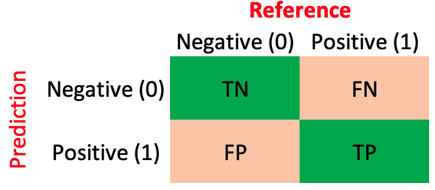

```{r setup, include=FALSE}
rm(list=ls())
require(pacman)
p_load(tidyverse,caret,class,gamlr,rio,modelsummary)
```

## **1. Métricas para problemas de clasificación**

{width=50%}

### **1.1. Matriz de confusión**

{width=50%}

* TP = True Positive (Verdaderos positivos)
* TN = True Negative (Verdaderos negativos)
* FP = False Positive (Falsos positivos o error tipo I)
* FN = False Negative (Falsos negativos o error tipo II)

#### **1.1.1. Accuracy** 

Es la tasa de predicciones correctas del modelo. Es decir, la ratio entre el número de predicciones correctas (Verdaderos) y el número total de predicciones.

$Accuracy= \frac{TP + TN}{TP + TN + FN + FP}$

#### **1.1.2. Sensitivity** 

Es la proporción de positivos que son predecidas bien. Es decir, la ratio entre el número de verdaderos positivos y el número positivos.

$Sensitivity = \frac{TP}{TP + FN}$

#### **1.1.3. Specificity** 

Es la proporción de negativos que son predecidas bien. Es decir, la ratio entre el número de verdaderos negativos y el número negativos.

$Specificity = \frac{TN}{TN + FP}$

#### **1.1.4. False Positive Rate** 

Es la proporción de predicciones positivas que son predecidas mal. Es decir, la ratio entre el número de falsos positivos y el número predicciones positivas.

$False Positive Rate = \frac{FP}{TP + FP}$

#### **1.1.5. False Negative Rate** 

Es la proporción de predicciones positivas que son predecidas mal. Es decir, la ratio entre el número de falsos positivos y el número predicciones positivas.

$False Negative Rate = \frac{FN}{TN + FN}$

## **Antes de empezar...**

Llamar/instalar las librerías para esta sesión:

```{r,eval=F}
## llamar la librería pacman: contiene la función p_load()
require(pacman)

## p_load llama/instala-llama las librerías que se enlistan:
p_load(tidyverse, caret, rio, 
       modelsummary, # tidy, msummary
       gamlr, # cv.gamlr
       class) # knn
```

## **2. K-Nearest Neighbors**

Vamos a cargar el conjunto de datos de **Motor Trend Car Road Tests (mtcars)** la cuál contiene información de algunas caracteristicas para 32 marcas de vehículos de 1974: millas por galón (mpg), número de cilindros (cyl), esplazamiento (disp), potencia bruta (hp), relación del eje trasero (drt), peso en miles de libras (wt), 1/4 de milla de tiempo (qseg), motor en forma de V (vs), transmisión manual (am), número de marchas hacia delante (gear) y número de carburadores (carb).

```{r, eval=T}
## obtener los datos
?mtcars
db <- tibble(mtcars)
head(db)
```

Intentemos predecir si un automovil tiene transmisión manual (1) o automatica (0):

```{r, eval=T}
## recategorizar variable
db = db %>% 
     mutate(am=ifelse(am==1,"manual (1)","automatic (0)") %>% as.factor())
```

```{r, eval=T}
set.seed(210422) ## fijar semilla
test <- sample(x=1:32, size=10) ## generar observaciones aleatorias
x <- scale(db[,-9]) ## reescalar variables (para calcular distancias)
apply(x,2,sd) ## verificar
```

```{r, eval=T}
k1 = knn(train=x[-test,], ## base de entrenamiento
         test=x[test,],   ## base de testeo
         cl=db$am[-test], ## outcome
         k=1)        ## vecinos 
```

Predicción contra datos observados

```{r, eval=T}
tibble(db$am[test],k1)
```

Obtener la matriz de confusión

```{r, eval=T}
confusionMatrix(data=k1 , reference=db$am[test] , mode="sens_spec" , positive="manual (1)")
cm = confusionMatrix(data=k1 , reference=db$am[test], positive="manual (1)")$table
cm
```

Obtener las metricas de clasificación

```{r, eval=T}
(cm[1,1]+cm[2,2])/sum(cm) ## Accuracy
cm[2,2]/sum(cm[,2]) ## Sensitivity
cm[1,1]/sum(cm[,1]) ## Specificity
cm[2,1]/sum(cm[2,]) ## Ratio Falsos Positivos
cm[1,2]/sum(cm[1,]) ## Ratio Falsos Negativos
```

## **3. Regresión: Logit y Probit**

Importar conjunto de datos:

```{r, eval=T}
## obtener datos
geih <- import("https://eduard-martinez.github.io/teaching/meca-4107/geih.rds")
head(geih)
```

#### **3.1. Estimar el modelo**

```{r, eval=T}
## modelo a ajustar
model <- as.formula("ocu ~ age + sex + factor(maxEducLevel)")

## estimación logit
logit <- glm(model , family=binomial(link="logit") , data=geih)
tidy(logit)
```

```{r, eval=T}
## estimación probit
probit <- glm(model , family=binomial(link="probit") , data=geih)
tidy(probit)
```

```{r, eval=T}
## ratio de los coeficientes
logit$coefficients / probit$coefficients
```

#### **3.2. Predicciones**

```{r, eval=T}
## preddicción
geih$ocu_log = predict(logit , newdata=geih , type="response")
geih$ocu_prob = predict(probit , newdata=geih , type="response")
head(geih)
```

```{r, eval=T}
## definir la regla
rule=0.7
geih$ocu_prob = ifelse(geih$ocu_prob>rule,1,0)
geih$ocu_log = ifelse(geih$ocu_log>rule,1,0)
head(geih)
```

#### **3.3. Clasificación**

```{r, eval=T}
## probit
cm_prob = confusionMatrix(data=factor(geih$ocu_prob) , 
                          reference=factor(geih$ocu) , 
                          mode="sens_spec" , positive="1")
cm_prob

## logit
cm_log = confusionMatrix(data=factor(geih$ocu) , 
                         reference=factor(geih$ocu_log) , 
                         mode="sens_spec" , positive="1")
cm_log
```

```{r, eval=T}
cm = cm_log$table
(cm[1,1]+cm[2,2])/sum(cm) ## Accuracy
cm[2,2]/sum(cm[,2]) ## Sensitivity
cm[1,1]/sum(cm[,1]) ## Specificity
cm[2,1]/sum(cm[2,]) ## Ratio Falsos Positivos
cm[1,2]/sum(cm[1,]) ## Ratio Falsos Negativos
```

