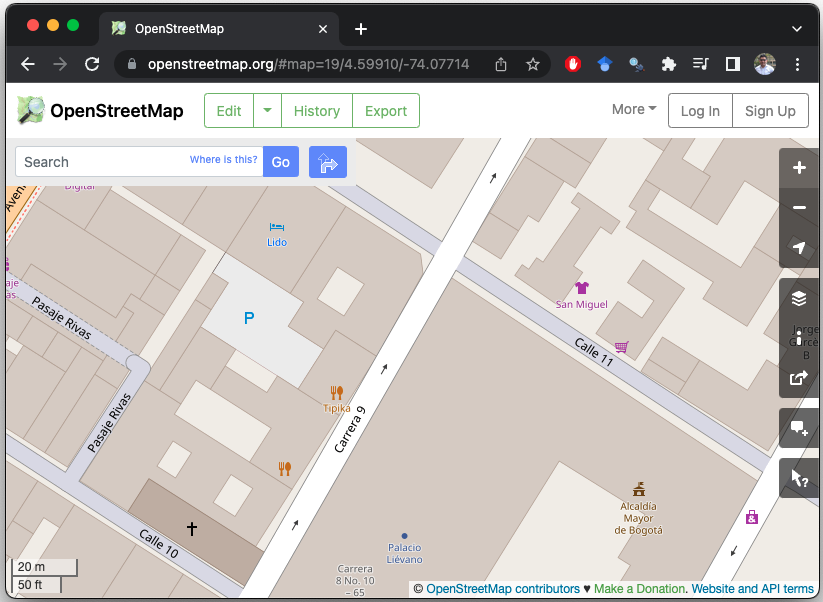

```{r setup, include=F , cache=F}
# load packages
require(pacman)
p_load(knitr,tidyverse,rio)
Sys.setlocale("LC_CTYPE", "en_US.UTF-8") # Encoding UTF-8

# option html
options(htmltools.dir.version = F)
opts_chunk$set(fig.align="center", fig.height=4 , dpi=300 , cache=F)
```

<!--=================-->
<!--=================-->

## **1. Checklist**

Antes de iniciar con esta lectura asegúrese de...

#### **☑ Lectures previas**

Puede darle una mirada a [Introducción a GIS en R](https://lectures-r.gitlab.io/blog/7-introduction-gis-in-r)

#### **☑ Versión de R**

Tener la versión `r R.version.string` instalada:

```{r, cache=T , echo=T}
R.version.string
```

#### **☑ Librerías**

Instale/llame la librería `pacman`, y use la función `p_load()` para instalar/llamar las librerías de esta sesión:

```{r , eval=T}
## Llamar pacman (contiene la función p_load)
require(pacman) 

## Llama/instala-llama las librerías listadas
p_load(tidyverse,rio,
       sf, # Leer/escribir/manipular datos espaciales
       leaflet, # Visualizaciones dinámicas
       tmaptools, # geocode_OSM()
       osmdata) # Get OSM's data
```

<!---------------------->
<!---- OpenStreetMap --->
<!---------------------->

## **2. OpenStreetMap**

OpenStreetMap ([OSM](https://www.openstreetmap.org)) es un proyecto de mapeo de acceso abierto global, gratuito y licenciado bajo [ODbL Licence](https://www.openstreetmap.org/copyright). OSM recopila información geográfica capturada con dispositivos GPS móviles, ortofotografías y otras fuentes de información libre. 

{width=500}

<!---------------->
#### **2.1. Geocodificar direcciones**

La función `geocode_OSM()` de la librería `tmaptools` se conecta a la API de `OpenStreetMap` y retorna el vértice con la coordenada geográfica del sitio/dirección buscado. 

```{r eval=T, include=T}
## Buscar un lugar público por el nombre
geocode_OSM("Casa de Nariño, Bogotá") 
```

Puede adicionar el argumento `as.sf=T` para generar un objeto de clase `sf`:

```{r eval=T, include=T}
## geocode_OSM no reconoce el caracter #, en su lugar se usa %23% 
point = geocode_OSM("Cra. 8 %23% 7-26, Bogotá", as.sf=T) 
point
```

Puede visualizar el objeto `point` usando la librería `leaflet`: 

```{r,eval=F,echo=T,warning=T,fig.height=1.5,fig.width=2.5}
## la función addTiles adiciona la capa de OpenStreetMap
leaflet() %>% addTiles() %>% addCircles(data=point)
```

<!---------------->
#### **2.2. Librería `osmdata`**

`osmdata` es una librería de R que permite descargar y usar datos de OpenStreetMap ([OSM](https://www.openstreetmap.org)). 

#### **2.2.1. Features disponibles**

Puede acceder a la lista de `features` disponibles en `OSM` [aquí](https://wiki.openstreetmap.org/wiki/Map_features). En R puede obtener un vector con los nombres de los `features` usando la función `available_features()`:

```{r eval=T, include=T}
available_features() %>% head(20)
```

Cada `feature` contiene una lista de `tags`. Puede acceder al vector de `tags` usando la función `available_tags()`. Por ejemplo, puede acceder a la lista de `amenity` así:

```{r eval=T, include=T}
available_tags("amenity") %>% head(20)
```

<!---------------->
#### **2.2. Descargar features**

Para descargar `features` desde `OSM`, primero debe definir un espacio geográfico y obtener la caja de de coordenadas que lo contiene:

```{r eval=T, include=T}
## obtener la caja de coordenada que contiene el polígono de Bogotá
opq(bbox = getbb("Bogotá Colombia"))
```

Puede almacenar un objeto `osm` de clase `list` y `overpass_query` con las estaciones de autobús para la ciudad de Bogotá:

```{r eval=T, include=T}
## objeto osm
osm = opq(bbox = getbb("Bogotá Colombia")) %>%
      add_osm_feature(key="amenity" , value="bus_station") 
class(osm)
```

Puede acceder a los `Simple Features` del objeto `osm` usando la función `osmdata_sf()`. El objeto contiene una lista de objetos con los puntos, líneas y polígonos disponibles.

```{r eval=T, include=T}
## extraer Simple Features Collection
osm_sf = osm %>% osmdata_sf()
osm_sf
```

Puede acceder a los elementos de la lista y crear un objeto de clase `sf`:

```{r eval=T, include=T}
## Obtener un objeto sf
bus_station = osm_sf$osm_points %>% select(osm_id,amenity) 
bus_station
```

Visualiza el objeto `bus_station`:

```{r,eval=F,echo=T,warning=T,fig.height=1.5,fig.width=2.5}
## Pintar las estaciones de autobus
leaflet() %>% addTiles() %>% addCircleMarkers(data=bus_station , col="red")
```

<!-------------------------------->
<!---- Operaciones geométricas --->
<!-------------------------------->

## **3. Operaciones geometrías **

Puede acceder a las viñetas de la librería [sf](https://github.com/r-spatial/sf) así:

```{r eval=F, include=T}
## Help
vignette("sf3")
vignette("sf4")
```

#### **3.1. Obtener datos**

```{r eval=T, include=T}
## apartamentos
housing = import("https://eduard-martinez.github.io/data/house_points.rds")
housing %>% head()

## precios medianos de las viviendas
mnz = import("https://eduard-martinez.github.io/data/mnz_prices_house.rds")
mnz %>% head()

## bares
bar = opq(bbox = st_bbox(mnz)) %>%
      add_osm_feature(key = "amenity", value = "bar") %>%
      osmdata_sf() %>% .$osm_points %>% select(osm_id,name)
bar %>% head()

## parque de la 93
park = getbb(place_name = "Parque de la 93", 
             featuretype = "amenity",
             format_out = "sf_polygon")
park %>% head()
```

Visualizar todos los objetos:

```{r,eval=F,echo=T,warning=T,fig.height=1.5,fig.width=2.5}
leaflet() %>% addTiles() %>% 
addPolygons(data=mnz) %>% # manzanas
addPolygons(data=park , col="green") %>%  # parque de la 93
addCircles(data=housing , col="red" , weight=2) %>% # apartamentos
addCircles(data=bar , col="black" , weight=2) # bares
```

#### **3.2. Precio de las viviendas**

Puede adicionar el precio mediano de las viviendas (`mnz`) a cada vivienda (`housing`):

```{r eval=T, include=T}
## Afinar las transformaciones
st_crs(mnz) == st_crs(housing)

## unir dos conjuntos de datos basados en la geometría
housing_p = st_join(x=housing , y=mnz)
housing_p
```

Puede adicionar el precio máximo de las manzanas vecinas a cada vivienda:

```{r eval=T, include=T}
## precio promedio
max_price = st_join(x=st_buffer(x=housing , dist=50) , y=mnz)
st_geometry(max_price) = NULL

## precio máximo
max_price = max_price %>% group_by(cod_apto) %>% summarise(price_max=max(median_price))
max_price

## join data
housing_p = left_join(x=housing_p , y=max_price , by="cod_apto")
housing_p
```

#### **3.3. Distancia a amenities**

Distancia al parque de la 93:

```{r eval=T, include=T}
## Distancia a parque
housing_p$dist_park = st_distance(x=housing_p , y=park)
housing_p
```

Matrix de distancias a todos los bares:

```{r eval=T, include=T}
## Distancia a bares
dist_bar = st_distance(x=housing_p , y=bar)
dist_bar
```

Puede calcular la distancia mínima a cada bar:

```{r eval=T, include=T}
## Distancia minima
min_dist = apply(dist_bar , 1 , min)
min_dist
housing_p$dist_bar = min_dist
housing_p
```

<!----------------->
<!--- Checklist --->
<!----------------->
### **Referencias**

* Lovelace, R., Nowosad, J., & Muenchow, J. (2019). **Geocomputation with R.** [[Ver aquí]](https://geocompr.robinlovelace.net)

  + Cap. 4: Spatial Data Operations
  + Cap. 5: Geometry Operations
  + Cap. 6: Reprojecting geographic data
  + Cap. 11: Statistical learning
  
* Bivand, R. S., Pebesma, E. J., Gómez-Rubio, V., & Pebesma, E. J. (2013). **Applied spatial data analysis with R.** [[Ver aquí]](https://csgillespie.github.io/efficientR/)

  + Cap. 4: Spatial Data Import and Export
  + Cap. 7: Spatial Point Pattern Analysis
  + Cap. 8: Interpolation and Geostatistics

